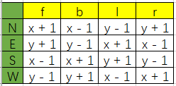

测初始化火星车在火星上的位置与朝向

1. 创建 test 文件夹，存放测试文件
    - 测试脚本 test_rover.py
    
2. 创建 scripts 文件夹，存放脚本
    - rover.py 火星车相关代码
    - mars.py 定义火星矩阵

3. 新建测试，默认通过  
    ```bash
    def test_rover_init_position():
        pass
    ```

4. 运行测试, 通过
    ```bash
    pytest -k test_rover_init_position -v
    ```

5. 包引用？
https://blog.csdn.net/qq_19339041/article/details/80088237

6. 添加测试
    ```python
    def test_rover_init_position():
        rover = Rover(2, 2, 'N')
        assert rover.init_position() == [2, 2, 'N']
    
    
    def test_move_forward():
        rover = Rover(2, 2, 'N')
        assert rover.move('f') == [3, 2, 'N']
    ```

7. 测试失败，修改代码，测试成功

8. 添加检查，是否已达边界 

9. 转向检查，坐标设置, (纵轴x, 横轴y)

10. 给Mars坐标系，添加边界，例如（10,10）

***
=== day 2 ===

11. 重构 rover move conditions to toolbox

    

12. 构建矩阵，利用反射减少 if 判断

13. 整理类方法

***
=== day 3 ===

14. 使用设计模式 [命令模式](https://blog.csdn.net/ruguowoshiyu/article/details/80865812)

15. [贪婪算法和动态规划](https://blog.csdn.net/qq_33848737/article/details/77466665) Information Only

16. The only commands you can give the rover are f,b,l, and r.